# Physical AI Trend Report Generator

**LangGraph + Tavily AI 기반 자동 트렌드 분석 보고서 생성 에이전트**

향후 5년 이내 기업에서 주목해야 할 Physical AI 트렌드를 자동으로 조사하고 분석하여 전문적인 PDF 보고서를 생성하는 AI 에이전트입니다.

[](https://www.python.org/)
[](https://github.com/langchain-ai/langgraph)
[](LICENSE)

## 📋 목차

- [주요 기능](#-주요-기능)
- [시스템 아키텍처](#-시스템-아키텍처)
- [설치 방법](#-설치-방법)
- [사용 방법](#-사용-방법)
- [보고서 구조](#-보고서-구조)
- [워크플로우](#-워크플로우)
- [출력 예시](#-출력-예시)
- [기술 스택](#-기술-스택)
- [API 키 발급](#-api-키-발급)
- [문제 해결](#-문제-해결)
- [라이선스](#-라이선스)

---

## 주요 기능

### **다차원 자동 리서치**
- **시장 전망**: Physical AI 시장 규모, 성장률, 투자 동향 분석
- **기술 트렌드**: 머신러닝, 센서 기술, AI-로봇 융합 등 최신 기술 동향
- **산업별 응용**: 헬스케어, 물류, 스마트시티, 제조업 등 분야별 활용 사례
- **주요 기업**: 글로벌 선도 기업 및 스타트업 동향
- **도전과제**: 윤리, 규제, 데이터 프라이버시 등 핵심 이슈

### **지능형 품질 관리**
- AI 기반 자동 보고서 품질 평가 (10점 만점)
- Few-shot Prompting으로 전문적인 보고서 기준 확립
- Total score 임계치 미만 시 자동 개선 및 재생성
- 5가지 평가 기준: 내용 완성도, 데이터 정확성, 구조 논리성, 실행 가능성, 전문성

### **전문적인 PDF 보고서**
- A4 사이즈, 한글 지원
- 다채로운 색상 팔레트와 공식 문서 스타일
- 요약, 본문, 결론, 참고자료, 품질 평가 포함
- 페이지 번호, 생성일, 출처 자동 삽입

### **병렬 처리 및 최적화**
- 5개 리서치 노드 동시 실행으로 시간 단축
- Tavily AI Advanced Search로 고품질 정보 수집
- 조건부 워크플로우로 효율적인 자원 활용

---

## 시스템 아키텍처

```mermaid

graph TD
    Start([시작: 사용자 요청]) --> Init[State 초기화]
    
    Init --> Planner[Planning Node<br/>리서치 계획 수립]
    
    Planner --> |계획 완료| ResearchRouter{Research<br/>Router}
    
    ResearchRouter --> |시장 데이터| Market[Market Research Node<br/>시장 규모, 성장률 수집]
    ResearchRouter --> |기술 동향| Tech[Tech Research Node<br/>VLA, Foundation Models]
    ResearchRouter --> |산업 사례| Industry[Industry Research Node<br/>제조, 물류, 헬스케어]
    ResearchRouter --> |기업 분석| Company[Company Research Node<br/>주요 기업, 경쟁 환경]
    ResearchRouter --> |도전과제| Challenge[Challenge Research Node<br/>장벽, 위험 요소]
    
    Market --> Synthesizer[Synthesis Node<br/>데이터 통합 및 분석]
    Tech --> Synthesizer
    Industry --> Synthesizer
    Company --> Synthesizer
    Challenge --> Synthesizer
    
    Synthesizer --> QualityCheck{Quality<br/>Check}
    
    QualityCheck --> |데이터 부족| ResearchRouter
    QualityCheck --> |충분| ReportGen[Report Generation Node<br/>보고서 작성]
    
    ReportGen --> Structure[Structure Node<br/>섹션별 콘텐츠 생성]
    
    Structure --> Review[Review Node<br/>품질 검증 및 개선]
    
    Review --> FinalCheck{Final<br/>Quality Check}
    
    FinalCheck --> |개선 필요| Refine[Refinement Node<br/>내용 보완 및 수정]
    Refine --> Structure
    
    FinalCheck --> |승인| Format[Formatting Node<br/>최종 포맷팅]
    
    Format --> End([완료: 보고서 출력])
    
    style Start fill:#e1f5e1
    style End fill:#e1f5e1
    style Planner fill:#fff4e6
    style ResearchRouter fill:#e3f2fd
    style Market fill:#f3e5f5
    style Tech fill:#f3e5f5
    style Industry fill:#f3e5f5
    style Company fill:#f3e5f5
    style Challenge fill:#f3e5f5
    style Synthesizer fill:#fff9c4
    style QualityCheck fill:#ffccbc
    style ReportGen fill:#c8e6c9
    style Structure fill:#c8e6c9
    style Review fill:#ffccbc
    style FinalCheck fill:#ffccbc
    style Refine fill:#ffe0b2
    style Format fill:#b2dfdb
```



### 주요 컴포넌트

| 컴포넌트 | 역할 | 기술 |
|---------|------|------|
| **Planning Node** | 사용자 Query에 따른 조사 계획 수립 | GPT-4o-mini |
| **Research Nodes** | 멀티 소스 데이터 수집 (5개 노드 병렬) | Tavily Search API |
| **Synthesis Node** | 데이터 통합 및 분석 | GPT-4o-mini |
| **Report Generation Node** | 보고서 초안 작성 | GPT-4o-mini |
| **Structure Node** | 보고서 구조화 작업 진행 | GPT-4o-mini |
| **Review Node** | 보고서 품질 평가 (Few-shot-Prompting) | GPT-4o-mini |
| **Refinement Node** | AI 피드백에 따른 보고서 보완 | GPT-4o-mini |
| **Formatting Node** | 최종 보고서 포맷팅 | ReportLab |

---

## 설치 방법

### 1. 저장소 클론

```bash
git clone https://github.com/K-coder555/AI-Agent-Mini-Project.git
cd AI-Agent-Mini-Project
```

### 2. 가상환경 설정 (권장)

```bash
# Python 3.8 이상 필요
python -m venv venv

# Windows
venv\Scripts\activate

# macOS/Linux
source venv/bin/activate
```

### 3. 패키지 설치

```bash
pip install -r requirements.txt
```

**requirements.txt:**
```
langchain>=0.1.0
langchain-openai>=0.0.2
langchain-community>=0.0.13
langgraph>=0.0.20
tavily-python>=0.3.0
reportlab>=4.0.0
python-dotenv>=1.0.0
```

### 4. 한글 폰트 설치 (Windows)

NanumGothic 폰트가 시스템에 설치되어 있어야 합니다:
- [NanumGothic 다운로드](https://hangeul.naver.com/font)
- 다운로드 후 `C:\Windows\Fonts`에 설치

---

## 사용 방법

### 1. 환경 변수 설정

`.env` 파일 생성:

```env
OPENAI_API_KEY=sk-your-openai-api-key
TAVILY_API_KEY=tvly-your-tavily-api-key
```

### 2. 실행

```python
from Agent import run_agent

# 기본 실행
query = "향후 5년 이내 기업에서 관심있게 봐야할 Physical AI 트렌드"
result = run_agent(query)
```

**또는 커맨드라인:**

```bash
python Agent.py
```

### 3. 결과 확인

```
✅ 보고서 생성 완료!
📈 품질 점수: 8.5/10
🔄 반복 횟수: 1
📄 PDF 보고서 생성 완료: physical_ai_report_20251023_094448.pdf
```

생성된 PDF 파일이 현재 디렉토리에 저장됩니다.

---

## 📄 보고서 구조

자동 생성되는 보고서는 다음 구조를 따릅니다:

```
📄 Physical AI 트렌드 예측 보고서 (2025-2030)

0. 핵심 요약
   └─ Executive Summary (1-2페이지)

1. 시장 전망
   ├─ 시장 규모 및 성장률
   ├─ 주요 응용 분야
   ├─ 스마트 제조와의 통합
   └─ 지역별 성장 가능성

2. 기술 트렌드
   ├─ 머신러닝과 로보틱스 융합
   ├─ 센서 기술 혁신
   ├─ AI 기반 물리적 세계 변환
   └─ 수직 특화 애플리케이션

3. 산업별 응용
   ├─ 헬스케어
   ├─ 물류
   ├─ 스마트 시티
   └─ 제조업

4. 주요 기업
   ├─ 글로벌 선도 기업
   └─ 혁신적 스타트업

5. 도전과제
   ├─ AI 윤리 및 규제
   ├─ 데이터 프라이버시
   └─ 기술 통합 문제

6. 향후 5년 전망
   └─ 예측 및 시사점

7. 전략적 권고사항
   └─ 기업 실행 가이드

8. 결론

9. 참고 자료 및 출처
   └─ Tavily AI 검색 결과 URL 목록

10. Appendix: 보고서 품질 평가 기준
    └─ 5가지 평가 기준 (각 20점)

보고서 품질 검토 결과
    ├─ 강점 분석
    ├─ 개선 필요 사항
    ├─ 세부 평가
    └─ 종합 점수: X.X/10
```

---

## 워크플로우

### Phase 1: 기획 및 조사 (Planning & Research)

```python
1. Planning Node
   └─ 조사 계획 수립 (5개 카테고리)

2. Parallel Research (동시 실행)
   ├─ Market Research      # 시장 데이터
   ├─ Tech Research        # 기술 트렌드
   ├─ Industry Research    # 산업 응용
   ├─ Company Research     # 주요 기업
   └─ Challenge Research   # 도전과제
```

### Phase 2: 분석 및 생성 (Synthesis & Generation)

```python
3. Synthesis Node
   └─ 수집된 데이터 통합 및 분석

4. Quality Check (조건부)
   ├─ 데이터 양 충분 → Report Generation
   └─ 데이터 양 부족 → Planning (검색 Query 수정하여 재조사)

5. Report Generation
   └─ 노드 수집 정보 기반 보고서 작성

6. Structure Node
   └─ 보고서 구조화

출처 추가
```

### Phase 3: 검토 및 최적화 (Review & Refinement)

```python
7. Review Node
   └─ AI 품질 평가 (10점 만점)

8. Final Quality Check (조건부)
   ├─ 점수 ≥ 7.0 → Formatting
   └─ 점수 < 7.0 → Refinement

9. Refinement Node (필요시)
   └─ AI 평가 피드백 반영하여 보고서 재작성

10. Formatting Node
    └─ 최종 보고서 PDF 생성 및 저장
```

---

## 출력 예시

### 콘솔 로그

```
🚀 Physical AI 보고서 생성 시작...
📝 요청: 향후 5년 이내 기업에서 관심있게 봐야할 Physical AI 트렌드

============================================================
📊 실행 로그
============================================================
✅ 조사 계획 수립 완료
🔍 시장 조사 완료 (5개 검색 결과)
🔍 기술 조사 완료 (5개 검색 결과)
🔍 산업 조사 완료 (5개 검색 결과)
🔍 기업 조사 완료 (5개 검색 결과)
🔍 도전과제 조사 완료 (5개 검색 결과)
📊 데이터 종합 완료 (25개 항목)
✅ 품질 확인 통과 (충분한 데이터)
✅ 보고서 생성 완료 (8개 섹션)
✅ 보고서 구조화 완료 (목차, 결론, 출처, 평가기준 포함)
✅ 품질 검토 완료 (점수: 8.5/10)
📝 리뷰 요약 저장
✅ 최종 포맷팅 완료
📄 PDF 보고서 생성 완료: physical_ai_report_20251023_094448.pdf

============================================================
✅ 보고서 생성 완료!
📈 품질 점수: 8.5/10
🔄 반복 횟수: 0
============================================================
```

### PDF 보고서 샘플


*실제 에이전트가 생성한 보고서 입니다.*

---

## 기술 스택

### Core Technologies

| 기술 | 버전 | 용도 |
|-----|------|------|
| **Python** | 3.8+ | 메인 언어 |
| **LangGraph** | 0.0.20+ | 워크플로우 오케스트레이션 |
| **LangChain** | 0.1.0+ | LLM 통합 |
| **OpenAI GPT-4** | gpt-4o-mini | 텍스트 생성 및 분석 |
| **Tavily AI** | 0.3.0+ | 웹 검색 및 정보 수집 |
| **ReportLab** | 4.0.0+ | PDF 생성 |

### Key Libraries

```python
langchain              # LLM 프레임워크
langchain-openai       # OpenAI 통합
langchain-community    # Tavily 통합
langgraph             # 상태 기반 워크플로우
tavily-python         # 고급 웹 검색
reportlab             # PDF 생성
python-dotenv         # 환경변수 관리
```

---

## 🔑 API 키 발급

### 1. OpenAI API Key

1. [OpenAI Platform](https://platform.openai.com/) 접속
2. 계정 생성 및 로그인
3. API Keys 메뉴에서 새 키 생성
4. 생성된 키를 `.env` 파일에 추가

**비용:** 
- GPT-4o-mini: $0.15/1M input tokens, $0.60/1M output tokens
- 평균 보고서 1개당 약 $0.10-0.30

### 2. Tavily API Key

1. [Tavily](https://tavily.com/) 접속
2. Sign up (GitHub/Google 계정 연동 가능)
3. Dashboard에서 API Key 확인
4. 생성된 키를 `.env` 파일에 추가

**비용:**
- Free Tier: 월 1,000 검색 무료
- Pro: 월 $29 (10,000 검색)
- 평균 보고서 1개당 25-30회 검색 사용

### 환경 변수 설정 예시

```env
# .env 파일
OPENAI_API_KEY=sk-proj-xxxxxxxxxxxxxxxxxxxxxxxxxxxxxxxx
TAVILY_API_KEY=tvly-xxxxxxxxxxxxxxxxxxxxxxxxxxxxxxxx
```

---

## 🐛 문제 해결

### 자주 발생하는 오류

#### 1. `FileNotFoundError: NanumGothic-Regular.ttf`

**원인:** 한글 폰트가 설치되지 않음

**해결:**
```python
# Option 1: NanumGothic 폰트 설치
# https://hangeul.naver.com/font 에서 다운로드

# Option 2: 다른 폰트 사용 (코드 수정)
KOREAN_FONT = 'Malgun Gothic'  # Windows 기본 한글 폰트
```

#### 2. `API Error: 401 Unauthorized`

**원인:** API 키가 잘못되었거나 만료됨

**해결:**
```bash
# .env 파일 확인
cat .env

# API 키 재발급 및 업데이트
```

#### 3. `RateLimitError: You exceeded your current quota`

**원인:** OpenAI API 사용량 초과

**해결:**
- [OpenAI Billing](https://platform.openai.com/account/billing) 에서 크레딧 충전
- API 요청 빈도 조절

#### 4. PDF 생성 오류

**원인:** 긴 텍스트나 특수문자 처리 실패

**해결:**
```python
# 보고서 길이 제한
state["final_report"] = state["final_report"][:50000]  # 최대 5만 자
```

### 디버깅 팁

```python
# 1. 상세 로그 활성화
import logging
logging.basicConfig(level=logging.DEBUG)

# 2. 중간 결과 저장
print(json.dumps(state["market_data"], indent=2, ensure_ascii=False))

# 3. 단계별 실행
# 각 노드를 개별적으로 테스트
```

---

## 📈 성능 최적화

### 실행 시간

| 단계 | 평균 시간 | 최적화 방법 |
|-----|----------|-----------|
| Planning | 15초 | 5초 |
| Research (5개 노드) | 60-80초 | 30-45초 |
| Synthesis | 30-40초 | 10초 |
| Report Generation | 50-80초 | 20-30초 |
| Review | 30초 | 10초 |
| PDF Generation | 5초 | 5초 |
| **총 소요 시간** | **3-5분** | **1.5-2분** |

### 비용 최적화

```python
# 1. 모델 다운그레이드
llm = ChatOpenAI(model="gpt-3.5-turbo")  # gpt-4o-mini 대신

# 2. 검색 결과 제한
search_tool = TavilySearchResults(max_results=3)  # 5 → 3

# 3. 재시도 횟수 제한
if state["iteration_count"] < 1:  # 2 → 1
```

---

## 기여하기

기여를 환영합니다! 다음 방법으로 참여하세요:

1. Fork the repository
2. Create your feature branch (`git checkout -b feature/AmazingFeature`)
3. Commit your changes (`git commit -m 'Add some AmazingFeature'`)
4. Push to the branch (`git push origin feature/AmazingFeature`)
5. Open a Pull Request

### 개선 제안 사항

- [ ] 다국어 지원 (영어, 일본어 등)
- [ ] 차트 및 그래프 자동 생성
- [ ] 웹 대시보드 UI
- [ ] 커스텀 템플릿 지원
- [ ] 더 많은 산업 분야 추가
- [ ] 실시간 업데이트 기능

---

## License

This project is licensed under the MIT License - see the [LICENSE](LICENSE) file for details.

```
MIT License

Copyright (c) 2025 Physical AI Report Generator Contributors

Permission is hereby granted, free of charge, to any person obtaining a copy
of this software and associated documentation files (the "Software"), to deal
in the Software without restriction...
```

---

## 👥 저자

- **L.J.H** - *Initial work* - [GitHub Profile](https://github.com/K-coder555)

---

## 🙏 감사의 글

이 프로젝트는 다음 오픈소스 프로젝트를 사용합니다:

- [LangChain](https://github.com/langchain-ai/langchain) - LLM 애플리케이션 프레임워크
- [LangGraph](https://github.com/langchain-ai/langgraph) - 상태 기반 워크플로우
- [Tavily AI](https://tavily.com/) - 고급 웹 검색 API
- [ReportLab](https://www.reportlab.com/) - PDF 생성 라이브러리

---

## 📞 연락처

- 이메일: yewnsgmlrns@naver.com

---

## 📚 추가 자료

- [LangGraph 공식 문서](https://langchain-ai.github.io/langgraph/)
- [Tavily AI API 문서](https://docs.tavily.com/)
- [OpenAI API 가이드](https://platform.openai.com/docs/)
- [ReportLab 사용자 가이드](https://www.reportlab.com/docs/reportlab-userguide.pdf)

---

<div align="center">

**⭐ 이 프로젝트가 유용하다면 Star를 눌러주세요! ⭐**

Made by L.J.H

</div>
